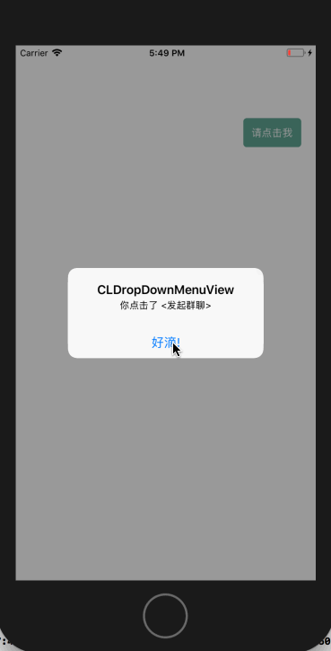
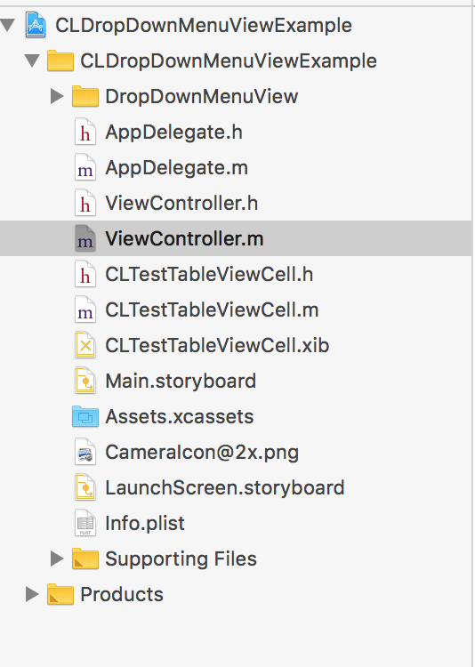

#CLDropDownMenuView
一个高度可定制的下拉菜单，效果如下：



## Getting Started 【开始使用】

### Features 【能做什么】
 DropDownMenuView 是一个提供高度自定制的下拉菜单。所以你可以根据的你的需要设置以下值。
```
-  右边距(rightMarign // 注意这个位置是相对于 - (void)addDropDownMenuToView:(UIView *)view要添加视图的右边距 默认是 15)
-  上边距(topMarign;   // 同上  上边距  默认是64；)
-  cell的样式(dropDownType;  // 默认的是显示文字和图片)
-  宽度(viewWidth; // 默认是150.00 最小宽度是60.0f)
-  最大显示行数(limitMaxCount; // 最多显示多少行  默认是5行 如果设置的值<=0 或者 >= 10 那么就是默认值)
-  能否拖动(bounces; // 默认是 NO. 能否拖动 )
-  cell的高度(itemHeight;  // 每个单元格的高度 默认是50；最小高度35（避免图片不能正常显示）；)
-  文字(textFont;  // 文字大小  默认14号系统字体)
-  文字颜色(textColor; // 文字颜色 默认0.25白色字体)
-  背景颜色(backgroundColor;   // 背景颜色 默认是白色)
-  是否可用(disableItemSelected;  // 不可用的状态是否可以被点击  默认是不可以)
-  不可用文字的大小(disableTextFont;  // 不可用的文字大小  默认14号系统字体)
-  不可用文字的颜色(disableTextColor;  //不可以文字颜色  默认0.88白色字体)
-  背景尖角的高度( pointedHeight;     // 背景图片尖的高度  默认是9.0f  根据自己图片尺寸进行调整)
-  背景的圆角(cornerRadius;   // 圆角半径  默认是5.f;)
```

### Installation 【安装】
#### From CocoaPods【使用CocoaPods】
```
pod 'CLDropDownMenuView'
```
安装成功后，引入头文件#import <DropDownMenuView/CLDropDownMenuView.h>
#### Manually【手动导入】

github地址：[CLDropDownMenuView](https://github.com/qcl901028/CLDropDownMenuView)
项目结构如下：


直接将DropDownMenuView 文件到导入你的项目，导入头文件#import "CLDropDownMenuView.h"即可。

#### Description 【描述】

图层分解：
```
CLDropDownMenuView --> 遮罩层UIView(黑色背景：bgMaskView) --> UIImageView(下拉菜单的背景图：bgImageView) --> UItableView(表格视图：tableView) -->UITableViewCell(点击的单元格)

```

可能用到的库文件分析：
```
    CLDropDownMenuView：下拉菜单视图类
    CLDropDownMenuValue：一些枚举
    CLDropDownMenuDelegate:代理回调
    CLDropDownMenuInfo:  每个单元格的信息
    CLDropDownMenuConfig： 配置每个单元格的样式
```

类中提供的的一些属性和方法
CLDropDownMenuView：
```
// 背景图片
@property (nonatomic, strong) UIImage *bgImage; 

// delegate
@property (nonatomic, weak) id<CLDropDownMenuDelegate> delegate;

//设置菜单数据
@property (nonatomic, strong) NSArray<CLDropDownMenuInfo *> *itemList; 

// 配置菜单信息
@property (nonatomic, strong) CLDropDownMenuConfig *menuConfig;  

// 是否显示
@property (nonatomic, assign, readonly) BOOL isShow;  


// 视图初始化
+ (instancetype)dropDownMenuView; 


// 添加视图到某个视图上
- (void)addDropDownMenuToView:(UIView *)view;  

//关闭下拉菜单  一般情况不用调用
- (void)dismissDropDownMenuView; 


// 刷新数据 也是显示菜单方法
- (void)reloadData; 


// 自定义Item单元格的   可以根据自己的爱好 自己定义
- (void)registerNib:(UINib *)nib forCellReuseIdentifier:(NSString *)identifier;
- (void)registerClass:(Class)cellClass forCellReuseIdentifier:(NSString *)identifier;
- (__kindof UITableViewCell *)dequeueReusableCellWithIdentifier:(NSString *)identifier;


```

CLDropDownMenuValue：

```
typedef NS_ENUM(NSInteger, CLDropDownType) {
    
    CLDropDownTypeAll = 0,  // 有文字和图片
    CLDropDownTypeOnlyTitle, // 只有文字
    CLDropDownTypeCustom    // 自定义item样式
    
};

```

CLDropDownMenuDelegate：

```
@protocol CLDropDownMenuDelegate <NSObject>


@required;

/* 点击了哪一行*/
- (void)dropDownMenuView:(CLDropDownMenuView *)dropDownMenuView didSelectIndex:(NSInteger)index;


@optional;
/* 视图将要显示 */
- (void)dropDownMenuViewWillShow:(CLDropDownMenuView *)dropDownMenuView;

/* 视图将要消失 */
- (void)dropDownMenuViewWillDismiss:(CLDropDownMenuView *)dropDownMenuView;

/* 视图已经显示 */
- (void)dropDownMenuViewDidShow:(CLDropDownMenuView *)dropDownMenuView;

/* 视图已经消失 */
- (void)dropDownMenuViewDidDismiss:(CLDropDownMenuView *)dropDownMenuView;


// 1.1.2  增加自定义item 
- (UITableViewCell *)dropDownMenuView:(CLDropDownMenuView *)dropDownMenuView cellForIndex:(NSInteger)index;

@end
```

CLDropDownMenuInfo：
```
// 图片名字
@property (nonatomic, copy) NSString *imageName; 

// 标题
@property (nonatomic, copy) NSString *title;  

 //是不是不能用
@property (nonatomic, assign) BOOL disable; 


```

CLDropDownMenuConfig：

```
@property (nonatomic, assign) CGFloat rightMarign;  // 注意这个位置是相对于 - (void)addDropDownMenuToView:(UIView *)view要添加视图的右边距 默认是 15


@property (nonatomic, assign) CGFloat topMarign;   // 同上  上边距  默认是64；


@property (nonatomic, assign) CLDropDownType dropDownType;  // 默认的是显示文字和图片


@property (nonatomic, assign) CGFloat viewWidth;  // 默认是150.00 最小宽度是60.0f


@property (nonatomic, assign) NSInteger limitMaxCount;  // 最多显示多少行  默认是5行 如果设置的值<=0 或者 >= 10 那么就是默认值


@property (nonatomic, assign) BOOL bounces;  // 默认是 NO. 能否拖动 


@property (nonatomic, assign) CGFloat itemHeight;  // 每个单元格的高度 默认是50；最小高度35（避免图片不能正常显示）；


@property (nonatomic, strong) UIFont *textFont;  // 文字大小  默认14号系统字体


@property (nonatomic, strong) UIColor *textColor; // 文字颜色 默认0.25白色字体


@property (nonatomic, strong) UIColor *backgroundColor;   // 背景颜色 默认是白色


@property (nonatomic, strong) UIFont *disableTextFont;  // 不可用的文字大小  默认14号系统字体


@property (nonatomic, strong) UIColor *disableTextColor;  //不可以文字颜色  默认0.88白色字体


@property (nonatomic, assign) CGFloat pointedHeight;     // 背景图片尖的高度  默认是9.0f  根据自己图片尺寸进行调整


@property (nonatomic, assign) BOOL disableItemSelected;  // 不可用的状态是否可以被点击  默认是不可以

@property (nonatomic, assign) CGFloat cornerRadius;   // 圆角半径  默认是5.f;


```


#### Examples 【示例】
具体可参照github [CLDropDownMenuViewExample](https://github.com/qcl901028/CLDropDownMenuView)

```

#import "ViewController.h"
#import "CLDropDownMenuView.h"
#import "CLTestTableViewCell.h"


@interface ViewController ()<CLDropDownMenuDelegate>

@property (nonatomic, strong) CLDropDownMenuView *dropDownMenuView;
@property (nonatomic, strong) CLDropDownMenuConfig *menuConfig;
@property (nonatomic, strong) NSMutableArray *itemsList;


@end

@implementation ViewController

- (void)viewDidLoad {
    [super viewDidLoad];
    // Do any additional setup after loading the view, typically from a nib.
    
    self.view.backgroundColor = [UIColor whiteColor];
    /********模拟数据*********/
    self.itemsList = [NSMutableArray new];
    for (int i = 0; i < 4; i++) {
        
        CLDropDownMenuInfo *info1 = [[CLDropDownMenuInfo alloc] init];
        info1.title = @"我是不能用的";
        info1.imageName = @"CameraIcon";
        info1.disable = arc4random()%2;
        [self.itemsList addObject:info1];
        
    }
    
    UIButton *btn = [[UIButton alloc] init];
    btn.frame = CGRectMake([UIScreen mainScreen].bounds.size.width - 100, 100, 80, 40);
    [btn setTitle:@"请点击我" forState:UIControlStateNormal];
    [self.view addSubview:btn];
    [btn addTarget:self action:@selector(showMenu) forControlEvents:UIControlEventTouchUpInside];
    btn.backgroundColor =  [UIColor colorWithRed:81/255.0 green:158/255.0 blue:138/255.0 alpha:0.9];
    btn.layer.cornerRadius = 5;
    btn.titleLabel.font = [UIFont systemFontOfSize:14];
    
    
}

- (void) showMenu {
     [self.dropDownMenuView reloadData];
}


// 创建下拉菜单视图
- (CLDropDownMenuView *)dropDownMenuView {
    
    if (!_dropDownMenuView) {
        _dropDownMenuView = [CLDropDownMenuView dropDownMenuView];
        _dropDownMenuView.delegate = self;
        _dropDownMenuView.menuConfig = self.menuConfig;
        _dropDownMenuView.itemList = self.itemsList;
//        [_dropDownMenuView registerNib:[UINib nibWithNibName:@"CLTestTableViewCell" bundle:nil] forCellReuseIdentifier:@"CLTestTableViewCell"];
        [_dropDownMenuView addDropDownMenuToView:[UIApplication sharedApplication].keyWindow];
    }
    return _dropDownMenuView;
}

// 根据项目需要可以自己定制样式
- (CLDropDownMenuConfig *)menuConfig {
    
    if (!_menuConfig) {
        
        _menuConfig = [[CLDropDownMenuConfig alloc] init];
        _menuConfig.rightMarign = 20;
        _menuConfig.topMarign = 145;
//        _menuConfig.dropDownType = CLDropDownTypeCustom;
//        _menuConfig.viewWidth = 150;
//        _menuConfig.itemHeight = 44;
//        _menuConfig.limitMaxCount = 5;
//        _menuConfig.pointedHeight = 15;
////        _menuConfig.cornerRadius = 15;
//        _menuConfig.backgroundColor = [UIColor redColor];
//        _menuConfig.disableItemSelected = YES;
    }
    return _menuConfig;
}


#pragma mark --
#pragma mark --  CLDropDownMenuDelegate

- (void)dropDownMenuView:(CLDropDownMenuView *)dropDownMenuView didSelectIndex:(NSInteger)index {
    
    NSLog(@"我点击了第%ld行",index);
    
}

- (void)dropDownMenuViewDidDismiss:(CLDropDownMenuView *)dropDownMenuView {
    
    if (self.dropDownMenuView == dropDownMenuView) {
        NSLog(@"视图已经消失");
    }
    
}


/* 视图将要显示 */
- (void)dropDownMenuViewWillShow:(CLDropDownMenuView *)dropDownMenuView {
    if (self.dropDownMenuView == dropDownMenuView) {
        NSLog(@"视图将要显示");
    }
}

/* 视图将要消失 */
- (void)dropDownMenuViewWillDismiss:(CLDropDownMenuView *)dropDownMenuView {
    if (self.dropDownMenuView == dropDownMenuView) {
        NSLog(@"视图将要消失");
    }
}

/* 视图已经显示 */
- (void)dropDownMenuViewDidShow:(CLDropDownMenuView *)dropDownMenuView {
    if (self.dropDownMenuView == dropDownMenuView) {
        NSLog(@"视图已经显示");
    }
}


//// 自定义cell样式 需要设置_menuConfig.dropDownType = CLDropDownTypeCustom;
//- (UITableViewCell *)dropDownMenuView:(CLDropDownMenuView *)dropDownMenuView cellForIndex:(NSInteger)index {
//
//    CLTestTableViewCell *cell = [dropDownMenuView dequeueReusableCellWithIdentifier:@"CLTestTableViewCell"];
//
//    CLDropDownMenuInfo *info = self.itemsList[index];
//
//    cell.label.text = info.title;
//
//    return cell;
//
//}


```

###### Q:这么写不是太麻烦了吗？
###### A:为了适用于更多的项目，CLDropDownMenuView提供了大量的可设置的属性以及方法。所以你可以根据项目需要，在CLDropDownMenuView的基础上封装适合自己项目的菜单视图。


## Expectation【期待】
如果在使用过程中遇到BUG，希望你能Issues我，谢谢（或者尝试下载最新的框架代码看看BUG修复没有）
如果在使用过程中发现功能不够用，希望你能Issues我，我非常想为这个框架增加更多好用的功能，谢谢


